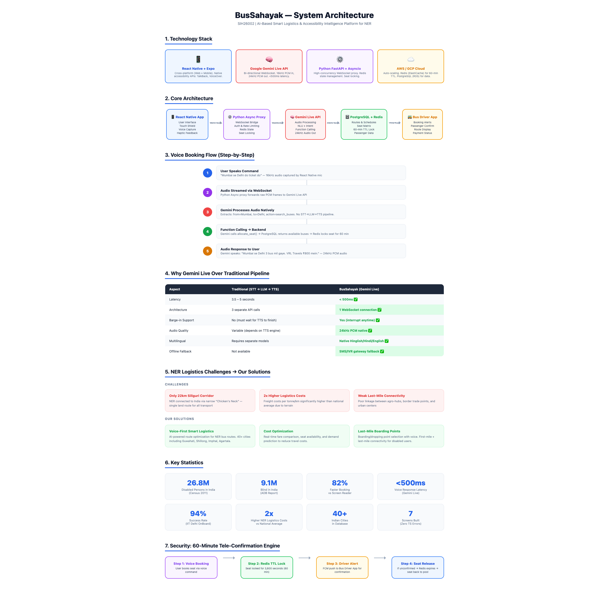
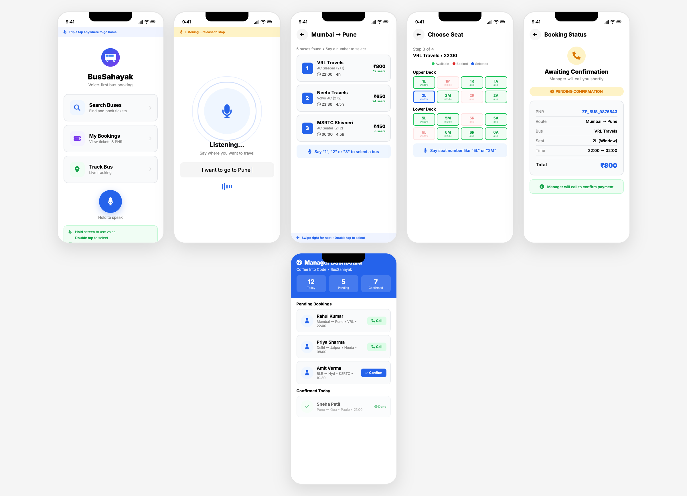

# BusSahayak (bus sahayak)

**AI-Powered Voice-First Bus Booking for Visually Impaired Users**

> A Smart India Hackathon 2025/2026 project targeting SIH26002 — "AI-Based Smart Logistics and Accessibility Intelligence Platform for North Eastern Region (NER)"

---

## Problem

26.8 million disabled persons in India (Census 2011), including 9.1 million blind (ADB Report). 83% face difficulty navigating public transport independently. Existing bus booking apps like RedBus and AbhiBus require full visual interaction — impossible for blind users.

## Solution

BusSahayak is a **voice-first, screen reader-optimized** bus booking app that enables blind and visually impaired users to search, select, and book bus tickets using only voice commands. No screen reading required. 82% faster than traditional accessibility tools.

---

## 3 Operating Modes

BusSahayak adapts to different levels of visual impairment with **3 unique operating modes**:

| Mode | Name | For Whom | How It Works |
|------|------|----------|--------------|
| **Mode 1** | Voice Only | Completely Blind Users | Touch LOCKED + Hands-free AI. 24kHz Audio + Haptics. Zero screen interaction needed. |
| **Mode 2** | Dynamic Switch | Low Vision Users | Starts Locked → Unlocks via Voice. Large Visual Picture Buttons for easy navigation. |
| **Mode 3** | Dual Combined | Voice + Touch Together | Tap = TTS + Hold = Mic. Always Active Visuals. Best of both worlds. |

### Mode 1: Voice Only (For Completely Blind)
- Screen is **locked** — no accidental taps possible
- **Hands-free AI** — just hold and speak
- **24kHz audio** responses via Gemini Live
- **Haptic feedback** confirms every action
- Triple tap anywhere → go home

### Mode 2: Dynamic Switch (For Low Vision)
- Starts in **locked mode** — voice-first
- **Unlocks via voice** command — "Unlock screen"
- **Large visual picture buttons** appear
- User can switch between voice and touch anytime
- Perfect for users with partial sight

### Mode 3: Dual Combined (Voice + Touch Together)
- **Tap** anywhere → Text-to-Speech reads content
- **Hold** screen → Activate microphone
- **Always active visuals** — buttons always visible
- Best for users comfortable with both input methods
- Most flexible mode

---

## Key Features

| Feature | Description |
|---------|-------------|
| **Voice-First Interface** | Hold screen to speak, release to get AI response. Natural Hinglish/Hindi/English. |
| **Touch Shield** | Blocks accidental taps. Triple tap = home, Double tap = select, Hold = voice. |
| **3 Operating Modes** | Voice Only, Dynamic Switch, Dual Combined — adapts to user's vision level. |
| **Number Selection** | Say "1", "2", or "3" to choose from search results. |
| **Seat Selection** | Say seat number like "5L" or "2M" to book. |
| **Manager Dashboard** | Manager calls blind user to confirm booking and collect payment. |
| **60-Minute Tele-Confirmation** | Redis TTL lock prevents seat hoarding. Driver confirms within 60 minutes. |
| **Last-Mile Integration** | Rapido/Auto integration for doorstep-to-bus-stand connectivity. |
| **Multi-Language** | Hindi, English, Hinglish, Tamil, Telugu, Bengali support. |
| **Offline Fallback** | SMS/IVR booking when no internet available. |

---

## Architecture

```
[REACT NATIVE APP] ──(16kHz Audio)──► [PYTHON ASYNC PROXY] ──(WebSocket)──► [GEMINI LIVE API]
        ▲                                             │                                  │
        │                                       (Function Call)                     (24kHz Audio Out)
        │                                             ▼                                  │
 [AUDIO ANNOUNCEMENT] ◄────────────────────── [POSTGRES / REDIS] ◄────────────────────────┘
                                                      │
                                           (Push Alert / FCM)
                                                      ▼
                                            [BUS DRIVER APP]
```

### Tech Stack

| Layer | Technology | Why |
|-------|-----------|-----|
| Frontend | React Native + Expo SDK 52 | Cross-platform (Web + Mobile). Native accessibility APIs. |
| Voice AI | Google Gemini Live API | <500ms latency. Bi-directional WebSocket. Barge-in support. |
| Backend | Python FastAPI + Asyncio | High-concurrency WebSocket proxy. Redis state management. |
| Cloud | AWS / GCP | Auto-scaling. Redis (ElastiCache) for 60-min TTL. PostgreSQL (RDS). |

### Why Gemini Live Over Traditional Pipeline

| Aspect | Traditional (STT → LLM → TTS) | BusSahayak (Gemini Live) |
|--------|-------------------------------|--------------------------|
| Latency | 3.5 – 5 seconds | **< 500ms** |
| Architecture | 3 separate API calls | **1 WebSocket connection** |
| Barge-in | No | **Yes** |
| Audio Quality | Variable | **24kHz PCM native** |
| Multilingual | Separate models | **Native Hinglish/Hindi/English** |

---

## UI Mockups

| Screen | Description |
|--------|-------------|
| Home | Voice-first landing with gesture hints |
| Voice Listening | Audio waveform, live transcript |
| Search Results | Numbered bus options (say "1", "2", "3") |
| Seat Selection | Visual seat grid with voice commands |
| Booking Status | PNR, fare, confirmation status |
| Manager Dashboard | Pending bookings, call to confirm |

---

## Screenshots

| Architecture | UI Mockups |
|-------------|------------|
|  |  |

---

## Project Structure

```
bus-sahayak/
├── app/                    # Expo Router screens
│   ├── home.tsx           # Voice-first home screen
│   ├── search.tsx         # Bus search with city selection
│   ├── results.tsx        # Numbered search results
│   ├── seat-selection.tsx # Visual seat grid
│   ├── booking.tsx        # Booking confirmation
│   └── tickets.tsx        # My bookings / PNR
├── components/            # Reusable UI components
├── hooks/                 # Custom React hooks
│   ├── useGestures.ts    # Touch Shield + gesture system
│   ├── useVoiceInput.ts  # Web Speech Recognition
│   ├── useVoiceOutput.ts # Web Speech Synthesis
│   └── useHaptic.ts      # Haptic feedback (mobile only)
├── services/              # Business logic
│   ├── conversationalAI.ts    # Full conversational engine
│   ├── intentClassifier.ts    # NLU / intent extraction
│   ├── responseGenerator.ts   # Spoken response builder
│   ├── cityData.ts            # 40+ Indian cities database
│   └── mockData.ts            # Mock bus data
├── store/                 # Zustand state management
├── theme/                 # Colors, accessibility settings
├── voice-engine/          # F5-TTS + gTTS voice cloning
├── assets/                # Images, icons, screenshots
└── architecture-diagrams.html  # System architecture
```

---

## NER Focus (SIH26002)

| Challenge | Solution |
|-----------|----------|
| Only 22km Siliguri Corridor | Voice-first smart logistics for NER bus routes |
| 2x Higher Logistics Costs | Real-time fare comparison and demand prediction |
| Weak Last-Mile Connectivity | Boarding/dropping point selection with voice |

---

## Getting Started

### Prerequisites

- Node.js 18+
- Expo CLI
- Google Gemini API key

### Installation

```bash
git clone https://github.com/doyalnitin/BusSahayak.git
cd BusSahayak
npm install
npx expo start
```

### Environment Variables

```bash
# .env
GEMINI_API_KEY=your_gemini_api_key
REDIS_URL=your_redis_url
DATABASE_URL=your_postgresql_url
```

---

## Voice Commands

| Command | Action |
|---------|--------|
| "Mumbai se Delhi ka ticket do" | Search buses |
| "AC chahiye" | Filter by AC |
| "Window seat do" | Select window seat |
| "Number 2" | Select second option |
| "Haan" / "Confirm" | Confirm booking |
| "Ghar jaao" / Triple tap | Go to home screen |
| "Mode 1" / "Voice Only" | Switch to Voice Only mode |
| "Mode 2" / "Dynamic Switch" | Switch to Dynamic Switch mode |
| "Mode 3" / "Dual" | Switch to Dual Combined mode |
| "Unlock screen" | Unlock touch in Mode 2 |
| "Rapido book karo" | Book Rapido to bus stand |

---

## Research & References

- [WHO Blindness Fact Sheet](https://www.who.int/news-room/fact-sheets/detail/blindness-and-visual-impairment)
- [IIT Delhi OnBoard Bus Identification](https://dl.acm.org/doi/10.1145/3411763.3445432)
- [Microsoft Inclusive Design](https://www.microsoft.com/design/inclusive/)
- [Google Gemini Live API](https://ai.google.dev/gemini-api/docs)
- [RPWD Act 2016](https://rpwd.gov.in/)
- [ADIP Scheme](https://depwd.gov.in/en/adip/)
- [Sugamya Bharat](https://sugamyabharat.gov.in/)
- [NER Logistics - ADB](https://www.adb.org/publications/working-paper/identifying-challenges-and-improving-trade-facilitation-north-eastern-region)

---

## Team

**Coffee Into Code**

| Name | Role |
|------|------|
| Nitin Doyal | Team Leader |

---

## License

MIT License

---

**Built for SIH 2025/2026 | Problem ID: SIH26002**
